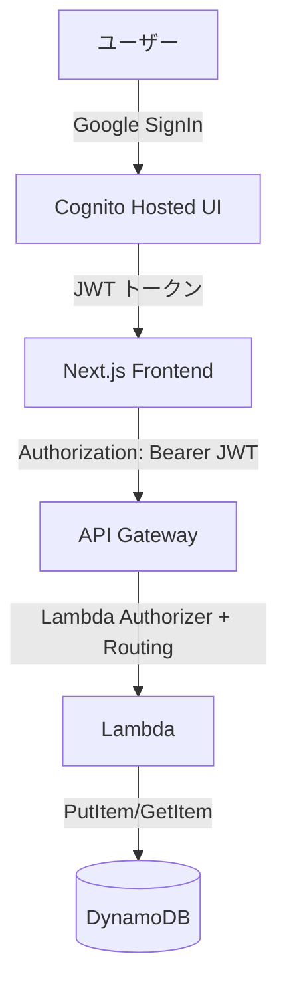

# QuickNotes App

---

## 目的

下記の勉強。

- aws cdk
- amplify gen2
- github actions
- google アカウントで ログインの認証形式 （メイン）

---

## 📌 プロジェクト概要

QuickNotes は、AWS Cognito + Google OAuth を使った認証と、API Gateway + Lambda + DynamoDB をバックエンドに持つメモ保存アプリです。Next.js (App Router) + Amplify ライブラリを利用しています。

---

## 🏗️ インフラ構成図



---

## ⚙️ 技術スタック

- **フロントエンド**: Next.js 14, TypeScript, Amplify UI ライブラリ
- **認証**: AWS Cognito + Google OAuth
- **バックエンド**: API Gateway + Lambda (Node.js)
- **データベース**: DynamoDB
- **IaC**: AWS CDK (TypeScript)
- **CI/CD**: GitHub Actions

---

## 🚀 セットアップ手順

### 1. 環境変数の設定

`.env.local` を作成し、以下を記載：

```env
NEXT_PUBLIC_APP_URL=http://localhost:3000
NEXT_PUBLIC_HOSTED_DOMAIN=<your-cognito-domain>.auth.ap-northeast-1.amazoncognito.com
NEXT_PUBLIC_USER_POOL_ID=<your-user-pool-id>
NEXT_PUBLIC_USER_POOL_CLIENT_ID=<your-client-id>
AWS_REGION=ap-northeast-1
AWS_ACCOUNT_ID=<your-account-id>
```

---

### 2. 依存関係のインストール

```bash
pnpm install
```

---

### 3. ローカル起動

```bash
pnpm dev
```

アクセス: http://localhost:3000

---

### 4. AWS CDK デプロイ

```bash
cd infrastructure
cdk deploy
```

---

## 🛠️ トラブルシューティング

- **ログインで `Attribute cannot be updated` が出る**

  - Cognito の属性マッピング設定を確認。`email` は **更新不可** にする。

- **API Gateway で `OPTIONS 401 Unauthorized` が出る**

  - Preflight (OPTIONS) には認証をかけない設定に修正する。

- **`Failed to fetch` が出る**
  - fetch 時に `Authorization: Bearer <JWT>` が正しく付与されているか確認。

---

## 📖 参考

- [AWS Amplify Docs](https://docs.amplify.aws/)
- [AWS CDK Docs](https://docs.aws.amazon.com/cdk/)
- [Next.js Docs](https://nextjs.org/docs)
